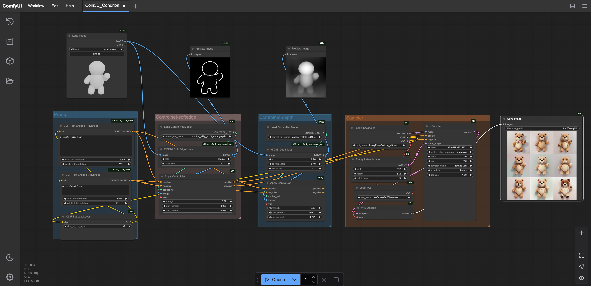

### Prepare condition image for inference
1. Rendering the proxy image

First you need to download [Blender](https://www.blender.org/) and unzip it to any directory. The version we use is [Blender-3.6](https://download.blender.org/release/Blender3.6/blender-3.6.12-linux-x64.tar.xz)
```
path/to/your/blender -b -P  blender_utils/render_proxy.py --  --obj_path example/teddybear/mesh.obj
```
The example rendered result can be found in this [image](example/teddybear/condition.png). Optionally, if you use blender to construct a coarse proxy, setting a different base color for each primitive can improve the effect of extracting softedges in ControlNet.

2. Use ComfyUI and Controlnet to construct condition image

**We have prepared a [Workflow](workflow/Coin3D_condition_workflow.json) using Depth-Condition and Softedge-Condition. You can pull the workflow into the ComfyUI interface to use it. Users can also use other controlnet conditions as needed.**
The usage of ComfyUI can be found [here](https://github.com/comfyanonymous/ComfyUI).

To run the above workflow, you need to download the following pretrained models. Here, we use the [Disney](https://civitai.com/models/65203/disney-pixar-cartoon-type-a) style basemodel as an example.
```
mkdir interactive_workflow
cd interactive_workflow
git clone https://github.com/comfyanonymous/ComfyUI.git
cd custom_nodes
git clone https://github.com/BlenderNeko/ComfyUI_ADV_CLIP_emb.git
git clone https://github.com/Fannovel16/comfyui_controlnet_aux.git

cd ../models/checkpoints/
wget https://huggingface.co/BitStarWalkin/RPG_models/resolve/main/disneyPixarCartoon_v10.safetensors

cd ../controlnet/
wget https://huggingface.co/lllyasviel/ControlNet-v1-1/resolve/main/control_v11f1p_sd15_depth.pth
wget https://huggingface.co/lllyasviel/ControlNet-v1-1/resolve/main/control_v11p_sd15_softedge.pth
```

Make sure ComfyUI has the following custom_nodes and pretrain models
:
```bash
ComfyUI
|-- models
    |-- checkpoints
        |--disneyPixarCartoon_v10.safetensors
    |-- controlnet
        |--control_v11f1p_sd15_depth.pth
        |--control_v11p_sd15_softedge.pth
|-- custom_nodes
    |-- ComfyUI_ADV_CLIP_emb
    |-- comfyui_controlnet_aux
```

After loading the workflow, it will be as shown below.
<div align=center>

</div>

You need to **load the rendered proxy image** into the Load Image Node, **set Text Prompt** in the CLIP Text Encode (Advance) Node, and finally **adjust the appropriate ControlNet parameters** in the Apply ControlNet Node.

Apply ControlNet Parameters Explanation: 
- `strength` The parameter controls the degree of influence that ControlNet has on the generated image. The value usually ranges from 0 to 1. The higher the value, the greater the influence that ControlNet has on the generated image; the lower the value, the less influence. For example, when strength is set to 1, ControlNet completely controls the generation process; when it is set to 0, ControlNet does not participate in the control.
- `start_percent` Specifies the point in the generation process (as a percentage) when ControlNet starts to take effect. For example, a value of 0.3 means ControlNet starts influencing at 30% of the process. **Normally this parameter is set to 0.**
- `end_percent` Specifies the point in the generation process (as a percentage) when ControlNet stops taking effect. For example, a value of 0.7 means ControlNet stops influencing at 70% of the process.


### Acknowledgement
We deeply appreciate the authors of the following repositories for generously sharing their code, which we have extensively utilized. Their contributions have been invaluable to our work, and we are grateful for their openness and willingness to share their expertise. Our project has greatly benefited from their efforts and dedication.
- [ComfyUI](https://github.com/comfyanonymous/ComfyUI)